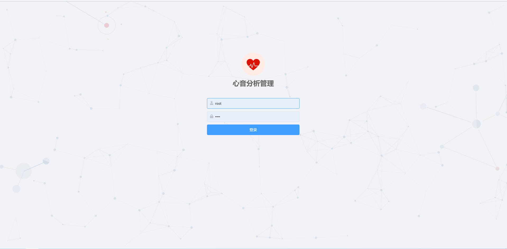
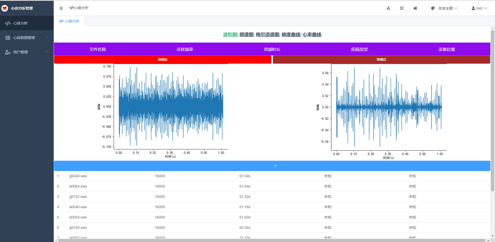
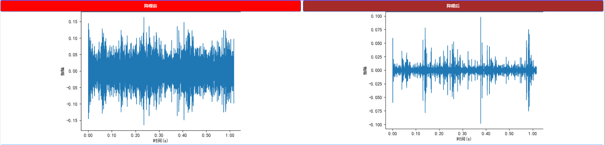
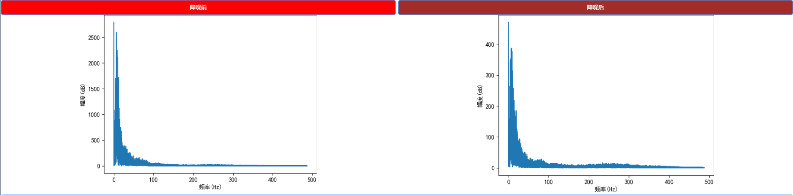
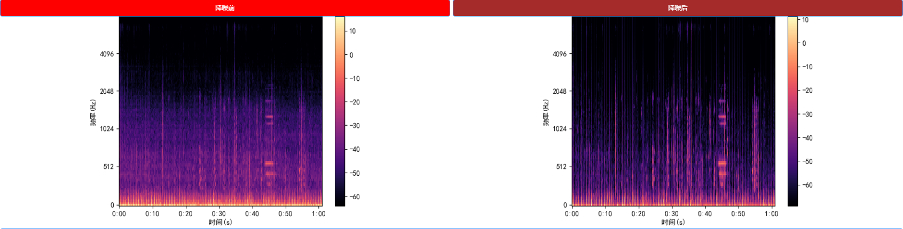
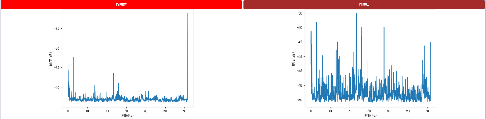
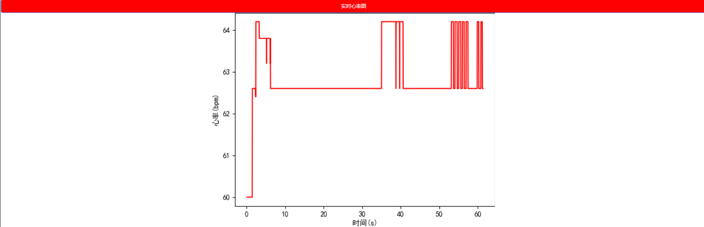
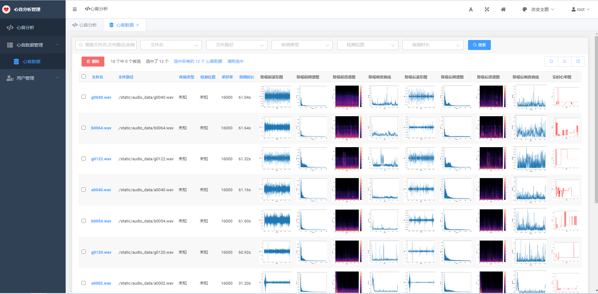

## 一、项目介绍

​		本项目名为心音分析，即对采集到的心音音频进行分析，心音分析的第一步是对心音数据进行降噪，去除无用的噪声，然后再对心音数据的响度、频率、振幅、响度和心率等性质进行分析，最后绘制出相应的图表，以使分析结果更为直观。

​		本项目采用前后端分离的方式构建应用，前端使用`vue3+element-plus`创建界面，以提供更好的交互和显示界面。在前端界面中，用户可以选择界面上显示的心音文件查看分析结果，也可以自己上传自己的心音文件进行实时分析，分析的结果以波形图、频谱图和语谱图、响度曲线和心率曲线等图像进行展示。后端使用了`django`框架来处理前端发来的请求，对请求解析后将相应的数据返回给前端进行展示，若请求的文件数据在数据库中已经存在，则直接将数据库中的数据返回给前端，若数据库中不存在，则调用心音分析模块进行分析，分析后的结果不仅会返回给前端，还会存入到数据库中。后端还配备了后台数据管理系统，在后台数据管理系统中，可以对所有的数据进行管理。


## 二、项目结构

### 1、前端项目结构

```bash
│  .browserslistrc
│  .eslintrc.js
│  .gitignore
│  babel.config.js
│  package-lock.json
│  package.json
│  README.md
│  tsconfig.json
│  vue.config.js
│  yarn.lock          
├─dist                               # 打包后的文件放置目录
│  │  favicon.ico                    # 页面图标
│  │  index.html                     # 打包后的网站主页
│  ├─css                             # 存放打包后的css文件
│  ├─img                             # 存放打包后的图片文件
│  └─js                              # 存放打包后的js文件
├─public             
│      favicon.ico
│      index.html    
└─src
    │  App.vue                       # 主视图
    │  main.ts                       # 主配置文件，程序入口
    │  shims-vue.d.ts 
    ├─assets                         # 用于存储静态文件
    ├─components                     # 组件目录
    │      FileFigure1.vue           # 波形图组件
    │      FileFigure2.vue           # 频谱图组件
    │      FileFigure3.vue           # 语谱图组件
    │      FileFigure4.vue           # 响度曲线组件
    │      FileInfo.vue              # 文件信息组件
    │      FileList.vue              # 文件列表组件
    │      FileUpload.vue            # 文件上传组件
    │      XLFigure.vue              # 心率曲线组件
    ├─router                         # vue路由目录
    │      index.ts                  # vue路由配置文件，用于配置vue各视图间的路由
    ├─store                          # vuex目录
    │      index.ts                  # vuex配置文件，用于组件间的变量共享
    └─views                          # 视图文件
            Figure1View.vue          # 波形图视图
            Figure2View.vue		     # 频谱图视图
            Figure3View.vue          # 语谱图视图
            Figure4View.vue          # 响度曲线视图
            FigureXL.vue             # 心率曲线视图

```


### 2、后端项目结构

```bash
│  manage.py              # django项目启动、管理文件
│  requirements.txt       # 项目运行所需要的库
├─Audio                   # 项目配置主文件夹
│     asgi.py          
│     settings.py         # 项目配置文件
│     urls.py             # Django的路由管理
│     wsgi.py
│     __init__.py 
├─heart                   # 本项目的app
│  │  admin.py            # 与管理后台相关的文件
│  │  apps.py
│  │  get_data.py         # 各种算法的实现和图标的生成
│  │  models.py           # 模型定义，即数据库中表的结构
│  │  tests.py            # 测试的
│  │  urls.py             # django的路由管理
│  │  views.py            # django的视图管理
│  │  __init__.py
│  └─migrations           # 用于存储模型或数据表变的变更
│      __init__.py
├─static                 # 一些静态文件存放目录
│  ├─audio_data          # 用于存储前端上传的心音文件
│  └─img                 # 用于存储一些与项目相关的
└─templates              # django 模板文件夹
```


## 三、使用的工具和库

开发系统：`Windows10`开发、`CentOS7`部署

开发语言：`Python`、`JavaScript`、`TypeScript`和`html`、`css`等

开发工具：`PyCharm`、`VSCode`、`node.js`和`vue-cli`

开发框架：前端：`vue3`、`element-plus`

​				   后端：`django`、`simpleui`

第三方库：`django`、`librosa`、`scipy`和`matplotlib`等，详见后端项目中的`requirements.txt`文件


## 四、效果展示

### 1、登录界面

访问地址为：`ip:port/admin`




### 2、管理后台

​		如下图所示，为方便查看，将前端的心音分析界面和后端的管理后台集成在一起了，左侧点击心音分析即进入心音分析的前端的页面，用户可以进行上传心音文件进行分析，也可以选择下方的列表查看已分析的文件信息，用户可以查看波形图、频谱图、语谱图、响度曲线和心率曲线等信息。




### 3、心音分析图表展示

#### （1）波形图



#### （2）频谱图



#### （3）语谱图



#### （4）响度曲线



#### （5）心率曲线




### 4、管理后台心音数据管理




## 五、项目说明

### 1、前端项目说明

​		前端部分采用了`vue3`为开发框架，主要使用`vue3`响应式`API`。使用了`element-plus`来快速构建页面，采用组件化的开发方式，将页面的各个部分都封装成组件的形式，再进行组装形成一个完整的界面。开发中，使用了`vue-router`来创建路由，每个图像界面都配置了一个路由地址，可以在不刷新界面的情况下只需要点击相应的元素，就可以查看各种分析图像。采用了`vuex`来进行组件间的数据共享，使用了`axios`来请求后端数据。

#### （1）项目依赖安装

#####  ①、首先安装`node.js`

​    在[node.js中文官网](http://nodejs.cn/download/)选择相应平台和版本即可下载安装


##### ②、国内用户可能需要更换npm的源

```bash
npm config set registry http://registry.npmmirror.com    # 换源
npm cache clean --force                                  # 清理缓存
```

##### ③、安装依赖

```bash
cd projectname # 进入项目所在目录
npm install    # 自动安装依赖
```

##### ④、运行项目

```bash
npm run serve
```


### 2、后端项目说明

​		后端部分采用`django`为主要开发框架，心音分析设计的各种算法都集中放在`django`项目中的`get_data.py`文件中，涉及到的主要算法有心音文件的读取、心音文件的降噪、响度的计算和心率的计算等，总体封装成了一个类，即心音处理类，该类的每一个方法对应一个算法或功能，当需要对心音文件进行分析时，创建相应的类即可以完成对心音文件进行分析，对心音文件进行分析后，会得到一些数据，为使结果更加的直观，我们将数据绘制成了各种图像，又为满足网络传输和数据库存储的需求，绘制的图像均保存为`Base64`格式，分析的结果会保存到数据库中，后端从数据库中读取文件后返回给前端进行展示。为满足多客户端的使用需求，后端在对心音文件进行处理时采用了多线程的方式，不影响主线程运行的条件下，依然可以对心音文件进行分析，主线程依然可以继续处理其他请求。

#### （1）项目依赖安装

根据项目文件中的`requirements.txt`进行安装，即：

```bash
python -m pip -r ./requirements.txt
```


#### （2）后端接口说明:

##### ①、获取所有文件信息

​	从数据库中查找所有的文件信息

- 请求地址：`/heart/all_fileinfo`

- 请求方法：GET

- 请求参数：无

- 返回参数：`JSON`列表，包含多个`JSON`对象，对象的`fields`属性为有用信息，其结构如下:

  | 名称     | 类型   | 说明     | 举例         |
  | -------- | ------ | -------- | ------------ |
  | filename | string | 文件名称 | "g0128.wav"  |
  | illness  | string | 疾病类型 | "二尖瓣术后" |
  | position | string | 采集位置 | "心尖部"     |
  | sr       | int    | 采样率   | 16000        |
  | times    | string | 音频时长 | “1.02s”      |


#####  ②、获取单个文件信息

- 请求地址：`/heart/single_fileinfo`

- 请求方法：GET

- 请求参数：`filepath`  

  注意：`filepath`参数的路径分隔符需为`/`，不可以为`//`和`\\`

- 返回参数：`JSON`列表，只包含一个`JSON`对象，对象的`fields`属性为有用信息，其结构如下:

  |   名称   |     类型      |      说明      |     举例     |
  | :------: | :-----------: | :------------: | :----------: |
  | filename |    string     |    文件名称    | "g0128.wav"  |
  | illness  |    string     |    疾病类型    | "二尖瓣术后" |
  | position |    string     |    采集位置    |   "心尖部"   |
  |    sr    |      int      |     采样率     |    16000     |
  |  times   |    string     |    音频时长    |   "1.02s"    |
  |   p11    | base64 string |  降噪前波形图  |      -       |
  |   p12    | base64 string |  降噪前频谱图  |      -       |
  |   p13    | base64 string |  降噪前语谱图  |      -       |
  |   p14    | base64 string | 降噪前响度曲线 |      -       |
  |   p21    | base64 string |  降噪前波形图  |      -       |
  |   p22    | base64 string |  降噪前频谱图  |      -       |
  |   p23    | base64 string |  降噪前语谱图  |      -       |
  |   p24    | base64 string | 降噪前响度曲线 |      -       |
  |    p3    | base64 string |    心率曲线    |      -       |


##### ③、文件上传

- 请求地址：`/heart/single_fileinfo`

- 请求方法：POST

- 请求参数：`file`  二进制文件  

- 返回参数：`JSON`对象

  |  名称   |  类型  |           说明           |    举例    |
  | :-----: | :----: | :----------------------: | :--------: |
  |   msg   | string | "上传成功"、"上传失败"等 | "上传成功" |
  | success |  bool  |       true或false        |    true    |

##### ④、首页
- 请求地址：`/index`

  首页地址可自定义，本项目默认设置为`vue3`项目的首页，可以在`heart`->`views.py`的`index`函数中进行修改

##### ⑤、管理后台
- 管理后台：`/admin`

首次使用的管理员账号和密码可以使用以下命令进行设置，之后的设置可在管理后台进行设置：

```bash
python ./manage.py createsuperuser
```

  管理后台使用`simpleui`进行美化，其官网地址为：[SimpleUI官网](https://simpleui.72wo.com/simpleui/)


#### （3）数据库使用说明

本项目数据库使用的是`MySQL8.0`

##### ①、配置数据库支持

​		在`django`项目中使用`MySQL`数据库需要安装`pymysql`，并在相应`App`目录（本项目为`heart`）下的`__init__.py`下添加以下代码:

```python
import pymysql
pymysql.install_as_MySQLdb()
```

##### ②、配置数据库信息

在数据库中先创建一个数据库：

```sql
create databases heart;
```

在项目的`setting.py`文件中找到`DATABASES`，对其进行设置，本项目的该变量为:

```python
DATABASES = {
    'default': {
        'ENGINE': 'django.db.backends.mysql',  # 数据库引擎
        'NAME': 'heart',  # 要连接的数据库，连接前需要创建好
        'USER': 'root',  # 连接数据库的用户名
        'PASSWORD': 'root',  # 连接数据库的密码
        'HOST': '10.8.130.254',  # 连接主机，默认本机
        'PORT': 3307  # 端口 默认3306
    },
}
```

##### ③、数据库初始化

​		首次使用项目或更换数据库时，需要删除`App`目录下`migrations`中除`__init__.py`外的所有文件，并依次执行以下命令。若只是模型变更，只需要执行以下命令而不用删除上述所说文件。

```bash
python -m ./manage.py makemigrations   # 查找模型变更
python -m ./manage.py migrate          # 将模型变更应用到数据库中
```

若需要访问管理后台，则需要创建管理员用户名和密码：

```bash
python ./manage.py createsuperuser
```


#### （4）`Django`允许跨域请求的解决方法(本项目已配置)

##### ①、安装`django-cors-headers`模块

```bash
python -m pip install django-cors-headers
```

##### ②、修改`setting.py`文件

`INSTALLED_APPS`处：

```python
INSTALLED_APPS = [
	...
    'corsheaders'，
 ] 
MIDDLEWARE_CLASSES = (
    ...
    'corsheaders.middleware.CorsMiddleware',
    'django.middleware.common.CommonMiddleware',
    # 'django.middleware.csrf.CsrfViewMiddleware',
    ...
)
```

`MIDDLEWARE_CLASSES`处：

```bash
CORS_ALLOW_CREDENTIALS = True
CORS_ORIGIN_ALLOW_ALL = True
CORS_ORIGIN_WHITELIST = (
    'https: ',#地址
)
CORS_ALLOW_CREDENTIALS = True
CORS_ALLOW_METHODS = (
    'DELETE',
    'GET',
    'OPTIONS',
    'PATCH',
    'POST',
    'PUT',
    'VIEW',
)

CORS_ALLOW_HEADERS = (
    'XMLHttpRequest',
    'X_FILENAME',
    'accept-encoding',
    'authorization',
    'content-type',
    'dnt',
    'origin',
    'user-agent',
    'x-csrftoken',
    'x-requested-with',
)
```


## 六、项目总结

​	  本项目涉及了前端、后端和心音分析算法的等各类知识和技能，对于我们来说，是一个很好的锻炼机会，有利于将各种知识和技能融汇贯通，提高个人能力。本项目最初使用qt做了可视化界面，但使用该项目需要安装一些软件，对大多数人很不友好。所以最终思量后采用了前后端结合的方式来开发项目，这样用户在任意终端上都可以通过浏览器进行访问使用该项目进行心音分析。做这个项目的时候花费了很多的精力，遇见了很多的问题，当时觉得很难，但是解决了之后却收获良多。

​		该项目实现了基本的心音分析，获得了心音文件的频率、波形、振幅、响度和心率等信息，并将这些信息进行可视化。但还有很多的不完善之处，如心率获取算法速度较慢，准确率也需要进一步提升，项目的可扩展性较差等，等以后掌握更多的知识后还需要进行不断优化，同时也为其他项目的开发提供了宝贵的经验。
