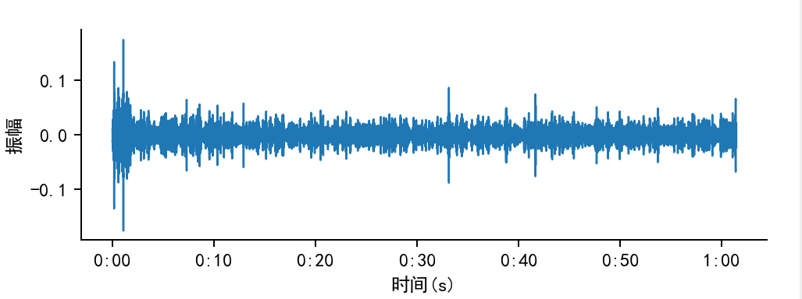
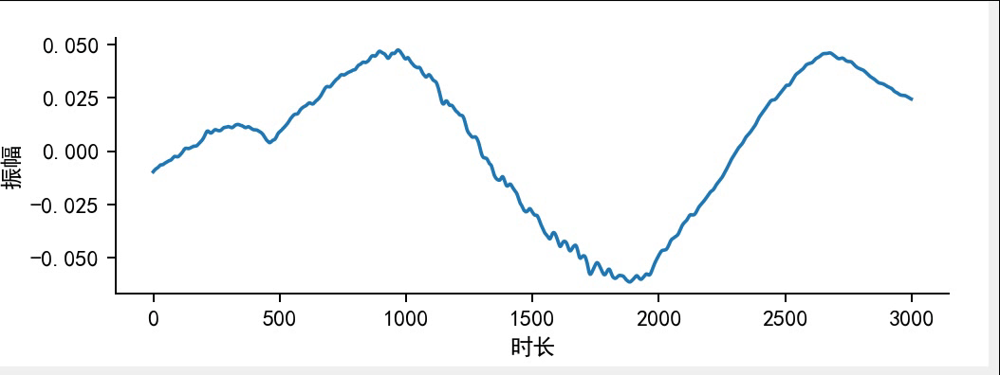

## 一、项目介绍

​		本项目名为心音分析，即对采集到的心音音频进行分析，心音分析的第一步是对心音数据进行降噪，去除无用的噪声，然后再对心音数据的响度、频率和振幅等性质进行分析，最后绘制出相应的图表，以使分析结果更为直观。

​		本项目采用`qt`和`matplotlib`结合的方式来显示分析结果，先使用`QtDesigner`设计用户交互界面，然后再设计数据处理相关的模块。用户从`qt`界面上不仅可以看出分析的结果，还可以选择文件进行分析，以及选择分析的图像，用户界面如下图所示：


​																										**图1 用户界面**


## 二、项目结构

```bash
├─ui                  	# 与用户界面有关的文件
| ├─ui.py			  	# 用户界面设计文件
| └─heart_audio.png   	# 应用程序图标
├─心音数据				 # 保存的模型
├─data_proce            # 文件处理相关的模块，包括心音数据的读取、降噪和绘制图形等操作
├─MyApp.py	            # 协调qt界面和文件处理模块的模块，是程序的关键部分
├─main.py               # 主程序，该项目的运行入口
├─requirements.txt      # 项目第三方库要求
└─README.md             # 项目描述文件		  
```

运行项目前先运行以下命令安装所需要的库，再运行`main.py`文件，也可以直接使用`PyCharm`等工具自动导入。

```bash
python -m pip install -r requirements.txt
```


## 三、使用的工具和库

开发语言：`Python3`

开发工具：`PyCharm`、`VSCode`和`QtDesigner`

第三方库：`librosa`、`matplotlib`和`PySide6`等，详见`requirements.txt`


## 四、项目具体思路

### 1、设计用户界面

​		 相比于其他图形库，`qt`提供了较好的用户界面设计工具——`QtDesigner`，使用该工具只要进行简单的拖拽，就可以设计用户界面，非常的方便。


​																								**图2 界面设计**

​		如上图所示，在进行界面设计时，考虑到用户需要选择文件进行分析，需要切换分析的图像，且有降噪文件前后对比的需要，故设计了如上所示的界面。

#### （1）文件选择按钮

​		最左侧的有三个按钮，这三个按钮用于选择需要分析的文件，选择文件时我们做了限制，限制用户只能够选择`.wav`、`.ogg`和`.mp3`格式的音频文件，防止用户选择错误的格式导致分析出错，当用户选择文件完毕后，会根据文件路径分析出用户选择音频文件采集时的位置和采集时用户的疾病。

#### （2）图像显示区域

​		右侧空白区域是为了显示图像，利用`matplotlib`等绘图工具绘制的图像会随用户的选择而出现在这里，一次会绘制三个文件降噪前后共六副图像，便于用户进行对比分析。

#### （3）图像选择按钮

​		底部有四个选择按钮，用户可以在四种图像中任意选择，选择后上方的绘图区域就会显示相应的图像。


### 2、处理音频数据

#### （1）读取数据

​		读取音频数据我们采用的是广泛使用的`librosa`库，该库读取音频数据后，会将因为数据转化为一个数组，该数组包含了文件的基本信息，接下来的分析都是对该数组内的元素进行分析和处理。

#### （2）文件降噪

​		心音文件在采集过程中不可避免的会采集到部分噪声，因此降噪十分必要。心音文件的降噪我们利用`scipy`库来构造巴特沃斯中值滤波器，利用该滤波器，实现对音频文件进行数字滤波，旨在滤除高频噪声以及直流噪声，同时尽可能保留心音信号。


#### （3）绘制相关图像

​	心音分析的目的是为了获取心音文件的频率、波长、响度和振幅等信息，这些信息使用图像进行展示将会更加清楚明了。为此，我们设计了四种图像，分别为静态波形图、动态波形图、频谱图和语谱图，这些图像在不同方面反应了心音数据的特性。

##### ①、波形图

​		我们绘制的波形图包括静态波形图和动态波形图，波形图为时域波形图，用于描述时长和振幅之间的关系。其中静态波形图是绘制出一段语音全部时间的波形图，较为密集，但能够看出整体趋势。而动态波形图，反应的是一个变化过程，可以观察到振幅随时间变化的关系，进一步反应声音随时间的变化关系。



​																										**图3 静态波形图**




​																											**图4 动态波形图**


##### ②、频谱图

​	频谱图，即音频信号频域的谱线，可以简单理解为频率分布图


                                                                                                               **图5 频谱图**


##### ③、语谱图

为了要研究一段时间内的言语声的变换，特别是频率的变化，需要用语谱图。语谱图的横轴为时间，纵轴为频率，强度则用灰度来表示。


​																											**图6 语谱图**


### 3、将文件处理和用户界面联系起来

#### 1、将`matpltlib`等绘制的图在`qt`界面显示

```python
from matplotlib.figure import Figure
from matplotlib.backends.backend_qt5agg import FigureCanvasQTAgg as FigureCanvas

figure=Figure(figsize=(width, height), dpi=100) # 创建绘图面板
figure_qt = FigureCanvas(figure) # 将其转化为qt对象
ax=figure.add_subplot(111) # 添加子图
layout.addWidget(figure_qt) # 布局中添加figure_qt
ax.plot(x,y) #绘图
librosa.display.specshow(logmelspec,sr=sr,ax=ax) #将ax作为参数传递，使画好的图显示出来
```

​		如上图所示，需要用到`matplotlib`中的`FigureCanvasQTAgg`方法将`matplotlib`中的图像类型转化为`qt`中的的Widget类型，再将其添加到布局中即可。


#### 2、`librosa`绘制的图如何在`qt`中显示

有些图像，如语谱图，我们是通过`librosa.display`绘制的，那么如何将其显示在`qt`界面中呢，如以下代码所示：

```python
librosa.display.specshow(logmelspec, y_axis='mel', sr=sr, x_axis='time') 			# 无法在qt界面中显示
librosa.display.specshow(logmelspec, y_axis='mel', sr=sr, x_axis='time', ax=ax)     # 可以在qt界面中显示
```

如上，只需要添加一个`ax`参数即可，该ax指定是一个图像常见的子图，如`1`中所示。

## 五、总结

​		本次心音项目让我了解到了音频分析的常见手段，了解了音频分析的全过程，为之后的语音分析、分类和处理提供了基础。本项目采用`qt`和`matplotlib`结合的方式来构建用户界面，但是该方式并不适合绝大多数普通用户，普通用户若想要运行程序，还需要安装`Python`以及`PySide`等各种库，一定程度上阻碍了用户的使用。那么，究竟什么交互模式才更利于用户使用呢？在经过一段时间的思考之后，我们决定使用网页端的方式来展示用户交互界面，即我们设计一个前端用户程序，用户只需要打开浏览器，输入网址，就可以进行进行使用。我们使用前后端分离的模式，后端用于数据的处理，部署在服务器上，前后端通过`http`请求发送数据，用户选择处理方式，服务端处理后将结果及时返回到用户界面。这么做的好处还有就是如果要开发相应的移动端`app`，那么后端基本上不用就行修改，只需要开发移动端即可，更方便用户使用。

